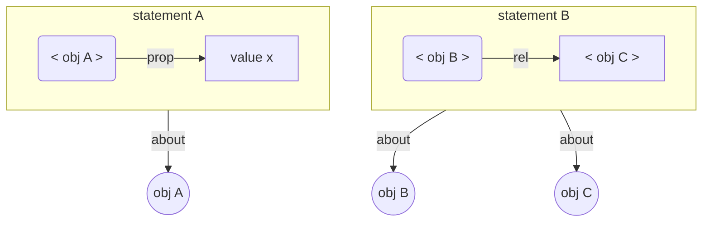

# Dataset, object, version, revision
This document attempts to define and explore the relationships between objects, their descriptions, the datasets that contain the descriptions and versions thereof.
###### IMPORTANT NOTICE
> This is not intended to be read as a set of *prescriptive* requirements. 

The following definitions intend to provide a *descriptive* framework in order to classify and better understand the versioned data representations of different information systems. The authors and architects of these systems are invited to use this framework to negotiate responsibilities of- and derive requirements for versioned data interchange.

## About objects
1. An `object` is anything with an [identity](#about-identity)
2. Objects are described in [datasets](#about-datasets)
3. The intention is that `object` is used for what might otherwise be called `domain objects`, i.e. the objects described in the datasets that we recieve and manage on behalf of the organization. The "objects" that we create and describe *in order to* manage domain objects will be referred to as `datasets` or `records`.


## About datasets
1. A `dataset` is anything that can be deterministically translated into RDF
2. All properties, relations, attributes, values or identifiers of objects are described in datasets. In other words, anything that can be said  *about* objects is said in some `dataset`.
3. We define the *content* of a `dataset` as the corresponding RDF in the n-triples format
   1. In particular, we assume a (stateless and deterministic) function `𝖲𝗍𝖺𝗍𝖾𝗆𝖾𝗇𝗍𝗌:𝑑𝑎𝑡𝑎𝑠𝑒𝑡⟶𝑅𝐷𝐹` [N-triples](https://www.w3.org/TR/n-triples/). This conversion gives the *content* of the dataset.
   2. We will refer to a `dataset 𝑑` and its content, the set of statements `𝖲𝗍𝖺𝗍𝖾𝗆𝖾𝗇𝗍𝗌(𝑑)`, interchangably.
4. Datasets with the same statements *are the same*:  
   ```
   ∀𝑥 ( ∃𝛼𝛽 𝑥 ∈ 𝛼 ⇄ x ∈ 𝛽 ) ≝ 𝛼 = 𝛽
   ```
   To be clear: If a dataset is changed, we get a new dataset with no implicit relation to the original dataset.
   1. However, a set of statements can not generally *name* itself (or give itself an identifier), so the question of wether two datasets are *intendend to be* the same is a matter of interpretation. If we are provided just a dataset *name* how do we know exactly which dataset the provider *intended* to refer to?
   2. This document attempts to make precise a way to *name* and *refer* to `datasets` through the notion of a `dataset` as a [record](#about-records) and to define the *intention* that any `reference` to the `record` be *transparent* in a portable way.
   3. This is done have a precise and unambigous vocabulary of definitions and requirements to build a format, semantic and protocol for communicating versioned changes of `object descriptions` between information systems.
5. Datasets have identities and may be described by other `datasets` or itself.
6. Unless describing itself, a `dataset` is not the same as the object(s) it may describe in its statements
   - A `dataset` must therefore use another identifier than that of any object it may describe, unless *this is the intended meaning*.

## Why datasets?
1. We chose `dataset` as the primitive concept instead of `objects`
2. This is a pragmatic choice that allows us to capture the *whole* of some communication package between communicating systems (like a HTTP POST message or an ODBC transaction) and identify its different parts:
   - The part of the package that contains a description of one or more *(domain)* `objects`
   - The part of the package that describes provenance information of the whole message or for the parts describing individual `objects` (doesn't matter)
   - The part of the prvenance information that describes version and revision relationships.
3. Using this language, we can specify constraints and articulate the responsibilities of communicating parties under a common conception of the semantics of `objects`, their relation to the `datasets` that describe them, and the provenance relationships between the `datasets`.

## About records
1. A `record` is a *`referentially transparent`* (𝑅𝑇) dataset.
2. This implies the existence of one or more *`references`* to a given `record`.
3. A `reference` must, by 𝑅𝑇, only and always refer to the same dataset (i.e. the same set of *statements*) for the dataset to qualify as a `record`.
4. Systems that communicate `records` must coordinate to preserve the transparency of records and their references. This means that all communicating systems must respect the *immutable* relation between a `record` and it's `reference(s)`.

## About ownership ("containment")
1. A dataset may be a `part` of another dataset.
2. Conversely, a dataset `contains` (or *owns*) its `parts`.
3. We define the `containment` of datasets:
   If all statements in dataset 𝑥 are also in dataset 𝑦 we say that `𝑥 is part of 𝑦` and that `𝑦 contains 𝑥`
   usually denoted `𝑥 ⊆ 𝑦`; 𝑥 is a sub-dataset (or just subset) of 𝑦.
4. We define the containment of records:
   For records 𝑠 and 𝑟, if `𝑠 ⊆ 𝑟` and, given the whole of 𝑟 and the `reference` to 𝑠, there is some known way to retreive 𝑠 from 𝑟 then `𝑠 is a subrecord of 𝑟`, 
   denoted 
   ```
   𝑠 ⊑ 𝑟
   ```
5. For an `object 𝑜` and a `dataset 𝑑` we define a `description of 𝑜 in 𝑑` to be a subdataset 
   ```
   𝑠ᵈ ⊆ 𝑑
   ```
   containing the statements in 𝑑 that are `about` 𝑜 in some known way.


## About versions
1. A `version` is defined as a dataset that:
   1. is related to <a name="av-1-1-something"></a>something with the relation `is a version of`
   2. may be in a  `is a revision of` relation with other `versions` that `is a version of` the same thing.
2. We call the "something"[[1.1]](#av-1-1-something) that a set of `versions` collectively `is a version of` A `versioned dataset`.
   1. a `versioned dataset` need not be a dataset itself, but this can prove to be practical in some circomstances.
3. An `immutable dataset` is a `versioned dataset` where all the `versions` are `records`.
4. A `subrecord 𝑟` of `version 𝑣` of an `immutable dataset 𝛢` is in a `is a revision of` relation to the `subrecord 𝑟′` of `version 𝑣′` provided that:
   1. `𝑣 is a revision of 𝑣′`
   2. the same retrieval function 𝕽 is used to get 𝑟 and 𝑟′: 
      ```
      𝑟 = 𝕽(𝑣) ∧ 𝑟′ = 𝕽(𝑣′)
      ```
      or alternatively, the `references 𝑅𝑒𝑓(𝑟) and 𝑅𝑒𝑓(𝑟′)` differ only in the `version` they reference: 
      ```
      𝑅𝑒𝑓(𝑟) ∪ 𝑅𝑒𝑓(𝑟′) − 𝑅𝑒𝑓(𝑟) ∩ 𝑅𝑒𝑓(𝑟′) = {𝑅𝑒𝑓(𝑣), 𝑅𝑒𝑓(𝑣′)}
      ```

## Scope (disambiguation)
- `Scope (business)`
- `Scope (version)`
- `Scope (mutating operation)`

## Business model and branch
- A `(business) model name` (also called aspect model name or asset model name) is a name used about some project or model that makes sense in the business domain
- A `(business) branch` is a combination of a business model name with enough extra information to uniquely identify a dataset for the given context. For example, a branch or project name. For each model name, there is a tree of branches.
  
- A `(business) model` (or aspect model) is any dataset that can be referred to with business model name or branch.
- The intention is that business model names should refer to the same, or similar, information in different datastores.

- In the simplest case, given a dataset 𝛼 (say, the asset model of a particular installation), a branch 𝑠ᵅ can be a subdataset `𝑠ᵅ ⊆ 𝛼`.
- In the versioned case, given an immutable dataset 𝛢 (say, the versioned asset model of a particular installation), a business scope could be *either*
  - a specific subrecord `𝑠ᵛ ⊑ 𝑣` for `𝑣 version of 𝛢`
    - 𝑣 could be the newest/HEAD (or some other specific) revision on some branch of 𝛢
    - 𝑠ᵛ could `contain` the descriptions `{𝑠ᵛ₁, 𝑠ᵛ₂, ..., 𝑠ᵛₙ}`  of any number 𝑛 of `objects` pertinent to the order of business, each of which may well be `records` themselves.
    - the scope 𝑠ᵛ could be identified by the banch or version id and additional information 𝜓 with which there is some deterministic way to extract 𝑠ᵛ from 𝑣. This 𝜓 could be a "scope name", and the *record provider* could maintain some internal map from "scope names" to sets of object ids used to determine `scopes` in `versions`.
  - a "scope name" 𝜓 that the *record provider* uses to determine a specific subrecord `𝜓(𝑣) ⊑ 𝑣` for any `𝑣 version of 𝛢`

## Version scope
1. For a `versioned dataset` 𝐴, statements in the same `𝑣 version of 𝐴` are in the same `(version) scope`. 
2. For an `object 𝑜` *described* in `𝑣 version of 𝐴`, that refers to another `object 𝑝`, the *description* of 𝑝 that is `in scope` is exactly the set of statements 𝑠ᵖᵥ that are `about` 𝑝 `contained in` 𝑣 :  `𝑠ᵖᵥ = {𝑥 ∈ 𝑣 | 𝑥 about 𝑝}`
3. By extension, statements and descriptions of *other* datasets (versioned or not) are trivially `out of scope`
4. Therefore, objects who depend upon each other, that is objects that are directly or indirectly related, or *could become* directly or indirectly related, and said relations are subject to versioning **MUST BE DESCRIBED IN THE SAME VERSIONED DATASET** or else their relations are **BY DEFINITION NOT VERSIONED**. To reiterate: when an object in one dataset refers to an object who's description lies in another dataset, their respective descriptions (and any records made thereof) are **OUT OF SCOPE OF EACHOTHER**.
5. Any contrivance to remedy the problems in pt 4. will **BY DEFINITION** amount to placing the descriptions of different objects **INTO THE SAME DATASET**. If you don't believe me I swear to God I will prove it algebraically and if you STILL disagree I WILL GIVE YOU HOMEWORK.

## Mutation scope
1. The `(mutation) scope 𝑠ᵝ` of a mutating `operation 𝛽` on a `dataset 𝑑` is the `subdataset 𝑠ᵝ ⊆ 𝑑` that may be *affected* by the execution of 𝛽.
2. When mutating a *(non versioned)*`dataset 𝑑` with an `UPDATE` or `DELETE` `operation 𝛽` understood in the usual way, unless otherwise specified the `scope 𝑠ᵝ` of the mutation would be assumed to be the whole of 𝑑.
3. When mutating a *(non versioned)*`subdataset 𝑠 ⊆ 𝑑` with an `UPDATE` or `DELETE` `operation 𝛽ˢ` we can assume that in order to construct 𝛽ˢ we would have to provide the contents of 𝑠 (that is: provide the `scope of 𝛽ˢ` directly) or provide information so that the `operation handler` of 𝛽ˢ can extract 𝑠 from 𝑑 i.e. resolve the `scope of 𝛽ˢ` and perform `UPDATE` or `DELETE`.
4. In the case of an `immutable dataset 𝐷` there shall be no mutation, but we shall in abuse of notation refer to the `mutation scope` of a `CREATE` or `UPDATE` `operation β` on `𝑣 version of 𝐷` as the subdataset `𝑠ᵝ ⊆ 𝑣` that may or may not be included in `𝑣′ = β(𝑣)` where `𝑣′ version of 𝐷` is created in handling β.
We handle mutation of immutable datasets 
###### TODO
> Finish this definition

## Dataset Provenance information
1. Provenance information in general for a dataset (or record) is information about the same dataset (or record). This information should use the IRI of the dataset (or record) and not the IRI of the object(s) described in the dataset. 
2. Some forms of provenance information are compulsory, and some are optional :
   1. Compulsory: Reference to the record it is supposed to replace (rec:replaces)
   2. Compulsory: Reference to the the branch and version in which it was updated. (What it means to be updated must be defined, see point 4 below)
   3. Compulsory: Reference to the branch and version from which is was fetched
3. For any set of versioned records, the provenance graph is the directed graph with the "previous record" relation as the edges and the datasets as nodes
4. Many merge conflicts / race conditions can occur when multiple nodes are edited by different processes. Possible mitigation mechanisms include:
   1. Maintaining (and providing in provenance info) the latest version and branch of the asset model in which any triple in the record was affected
   2. Maintaining (and providing in provenance info) the latest version and branch of the asset model in which any RDF individual in the record was affected. The definition of what is an individual might change between asset models.
   3. Storing (versioned) references to "related" records. This is similar to storing edges as versioned objects.


   
## Dataset history
1. A set of datasets is a valid dataset history if the provenance graph where a <= b if b rec:replaces a, is a set of disjoint lattices. The set of maximal nodes (one for each lattice) in this graph is called the "head" or "current version", and the set of minimal nodes is the "first version"
2. A valid dataset history H and a mapping M from  the natural numbers to subsets of H is a complete dataset history if rdf:nil is the single minimal element and if 
   1. M(1) = the first version of M(i) for any i
   2. M(i) subset or equals M(i+1)
   3. M(i) is a lattice for any i
   4. If M(j) = M(j+1), then M(k) = M(k+1) for any k > j
3. The arguments to the mapping M for a complete dataset history are called version numbers, while the values are called versions. The smallest j such that M(j) = M(j+1) is the latest version.

## `Business Change` and `Dataset Transaction`
1. We define a `dataset transaction 𝜏` as a function `𝜏:𝑑𝑎𝑡𝑎𝑠𝑒𝑡⟶𝑑𝑎𝑡𝑎𝑠𝑒𝑡` that, when applied to a `dataset 𝑑` returns a *changed* `dataset 𝜏(𝑑) = 𝑑′`
2. Sometimes it makes sense to "package" a set of transactions into the composed larger transaction, f.ex. when replaying a list of transactions. This is easy to express with function composition, but the order must be maintained.
   
3. A [business change](considerations-collaboration.md) `𝕔` to a [model](considerations-collaboration.md) `𝕄` corresponds to one or more `transactions 𝑡ₙ` applied to a `representation 𝕽(𝕄)` of 𝕄
```
   𝕔 ≋ 𝜏ₙ ∘ 𝜏ₙ₋₁ ∘ … ∘ 𝜏₁(𝕽(𝕄))
     = 𝜏ₙ(𝜏ₙ₋₁(… 𝜏₁(𝕽(𝕄)) …)) 
     = 𝕽(𝕄)′
   ```

## Transactions and syntactic merge conflicts
1. A valid dataset history represents the dataset transaction which consists of taking the union of the original dataset and the dataset history. When a dataset history is viewed as a transaction in this manner, we call it a    `transaction dataset`
2. In practice, such a transaction dataset will usually either be a set of datasets with no edges in the provenance graph, or a complete dataset history.
3. Applying a transaction dataset to a complete dataset history is simply to take the union of the two datasets and update M with a new latest version that maps to the whole set.
4. A syntactic merge conflict occurs if the resulting union seen as a provenance graph is not a set of lattices. This will in practice occur if some dataset in the transaction has a rec:replaces relation to a dataset that is not in the head.

## Datastore
1. A `datastore` is a mapping from business scope names to datasets
   1. A business scope can be (e.g.) an asset model or some defined part of an asset model
   2. How, when and to whom the dataset of a business scope is provided is ENTIRELY up to the `provider` which holds/owns the `datastore`.
    
## Versioned Datastore
1. A `versioned datastore` is (an implementation of) a mapping from business scope names to complete dataset histories.
2. Branching is to add a ~~new key-value pair to a datastore, where the initial value is a copy of an existing complete dataset history~~ new mapping from `business scope name` to a "path" in the dataset history, *ending* in a particular `version`. In other words, to *virtually* or *effectively* create a new `head` associated with the `business scope name`.
3. Merging branch A into branch B means simply to apply A as change to B
   
## Historic dataset delta
1. For a dataset d that occurs in the complete dataset history s, the historic delta of d and s is a transaction calculated like this:
   1. Let m be the latest version of s
   2. Let a be the highest i such that d is in M_s(i)
   3. The delta is M(m)-M(a)

## Semantic merge conflicts
1. A semantic merge conflict is a pair of a transaction and a complete dataset history that is deemed invalid.
2. Typically, overlaps between the RDF individuals metnioned in a transaction and in the historic delta will imply a semantic merge conflict


## More about datasets
1. For our purposes, anything that admits normalization (without loss of semantic content) to an RDF Graph (i.e. a set of *subject, predicate, object* triplets or *statements*), can be considered a dataset. In particular, the type 𝑇 of a given dataset must admit to a normalization functor `𝔑𝔬𝔯𝔪ᵀ: 𝑇⟶𝑅𝐷𝐹𝐺𝑟𝑎𝑝ℎ`, where 𝑅𝐷𝐹𝐺𝑟𝑎𝑝ℎ is the type of *sets of RDF statements*. The normalization `g ∈ 𝑅𝐷𝐹𝐺𝑟𝑎𝑝ℎ` of a given dataset `d ∈ 𝑇`, denoted `𝔑𝔬𝔯𝔪ᵀ(d) = g` defines the *semantic content* of d. The normalization functor `𝔑𝔬𝔯𝔪ᵀ` induces two relations on datasets of type `𝑇`:
   1. An inclusion relation `⊆ᵀ` given by inclusions in 𝑅𝐷𝐹𝐺𝑟𝑎𝑝ℎ `∀ₘ∀ₙ 𝔑𝔬𝔯𝔪ᵀ(m) ⊆ 𝔑𝔬𝔯𝔪ᵀ(n) ⇒ m ⊆ᵀ n`
   2. A *semantic equivalence* `≡ᵀ` given by identification of normalizations `∀ₘ∀ₙ 𝔑𝔬𝔯𝔪ᵀ(m) = 𝔑𝔬𝔯𝔪ᵀ(n) ⇒ m ≡ᵀ n`
   
   When using set notation on datasets, assume the corresponding relation induced by an appropriate normalization functor.

## About statements and identifiers
A *statement*, given by itself or retreived from a dataset (by way of an appropriate normalization functor) says something about an object by assigning a property or relation to the objects *identifier*.

here, `statement A` uses the object identifier `< obj A >` (which identifies the object `obj A`) to assign a property `prop` with the value `val x` *to the object* `obj A`. It is not assigned *to* the object identifier `< obj A >`, it is assigned *through* the identifier. `statement A` is *about* `obj A`, not `< obj A >`. In the same way, `statement B` relates `obj B` to `obj C` through the relation `rel`.

## More about records
1. A `record` is something that was *recorded* somewhere, at some time.
2. *Where* and *when* a recording happend is:
   1. Important *provenance* information, ideally included in the record itself.
   2. likely to be used to retreive the record at a later time.
3. For our purposes, 
   1. *what* a record *records*, is a [dataset](#about-datasets)
   2. it holds a *reference*, which understood as a reference to the particular dataset it records
   3. therefore: a reference taken together with a dataset is a `record`, subject to the following conditions.
4. If the world changes after a record was made, so as to render incorrect any recorded statements, it is still true that this particular record was made, at that particular time. The content of a record (i.e. it's dataset) is therefore *immutable*.
5. If a record is made in some particular location, and later moved, it is still true it was made at that place, at that time. The record's address in space and time, or its *reference* is therefore immutable.
6. Immutability of content and reference, taken together, makes up the only real constraint on `records`: Records are *referentially transparent* (𝑅𝑇).
7. Anything that may be used to *retreive* a particular dataset -- It's physical location, time of recording, version identifier, object identifier, filing cabinet drawer and folder, an SQL query, a SPARQL query, an HTTP request or any combination thereof or something else entirely -- in a referentially transparent way,  is implicitly a reference to the dataset, and the two taken together is implicitly a `record`.

## Some kinds of record references
- `Resolvable references`: A reference is resovable to anyone who knows a way of retreiving a dataset in an 𝑅𝑇 way.
  - An URL to a resource that does not change
  - An identifier of a known immutable RDBMS together with an SQL query
- `Versioned reference`: A reference for which there is some known way to extract version information, slik at man kan avgjøre om to versjonerte referanser er versjoner av det samme eller ikke.


## Some kinds of records
- `Implicit records`: Anything retreived from a referentially transparent source.
  - HTTP request/response pair from an 𝑅𝑇 endpoint
  - SQL query/result set pair from a time-series (or other kind of immutable) RDBMS
- `Self referencing records`: A dataset from which there is some known way to extract a reference, subject to the constraint that if the same reference is _ever_ extracted from another dataset, their content is the same (𝑅𝑇)
  - GIT object files (commits, blobs, trees), as the reference is a SHA-1 hash of the object file contents.
  - **A carefully specified RDF encoding of a record with provenance, where the provenance information includes the reference**
- `Self versioning records`
- `Self revisioning record`


## About record providers
1. A `record provider` is a system that provides records.
2. The `record provider` must maintain a function 𝕽𝔢𝔣 from references to datasets that defines the `records` kept by the provider.
3. By using namespaces, record providers can prevent reference collisions without coordination.
<!-- 
## About change
1. 

## Versioned record of a dataset
1. A versioned record of a dataset rᵖ is a triple (id, d, p) of id and d from record r and some provenance information p.

## Versioned dataset
A *verisoned dataset* Dᵖ = (R,s) is a set of versioned records of datasets goverened by a by a versioning function **s**(idᵥ, p):Iⱽ⨯P⟶Iᴰ such that Rᵖ = {(o,d,p) | (o,s(o,p)) ∈ R} i.e. each object-id/provenance pair (o,p) is only mapped to one piece of data present in some record already in R. -->


<!-- ## Record of a versioned dataset


## Revisioned dataset
A *Revisioned dataset* Rˢᵥ is a versioned dataset Rᵖ governed by the versioning function s:I⨯P⟶D together with a revisioning function vᵦ:P⨯P⟶β
imposing an ordering on the set of provenance information.
- If v imposes a total order, the revisions are all in an uninterupted series
- if v imposes a preorder, the revisions form a tree (either branching or mergin)
- if v imposes a lattice, revisions for a DAG with both brancing and merging -->

<!-- ## Record of an object in a dataset
Given a dataset d:D and an object o with identifier idₒ:I a *record of o in d* rₒ = ℜ(idₒ,d,𝕔) is a tuple (idₒ, 𝕔(idₒ,d)) where 𝕔:I×D⟶𝔓(S) is a *closure operation*  -->

<!-- ## Versioned record of an object in a versioned dataset ⟺ Versioned record of an object -->


## About identity
*Identity* has the sense that som object may be 
1. Distinguished from objects with a different identity 
2. Referenced *Universally* e.g. by associating the identity with an URI or UUID
3. Referenced *Locally* within a defined context 
   - e.g. an index on a table; a given integer may index rows on may tables but it is a reference to our object of interest only in the local context of a particular table. 
    - e.g. RDF blank nodes within an RDF document.
4. Referenced *Indirectly* by relation to some other object. An object whose identity is not associated with some identifier is said to be *anonymous* and can only ever be referenced *idirectly*. 
   - e.g. a JSON property having  a nested object as its value.
